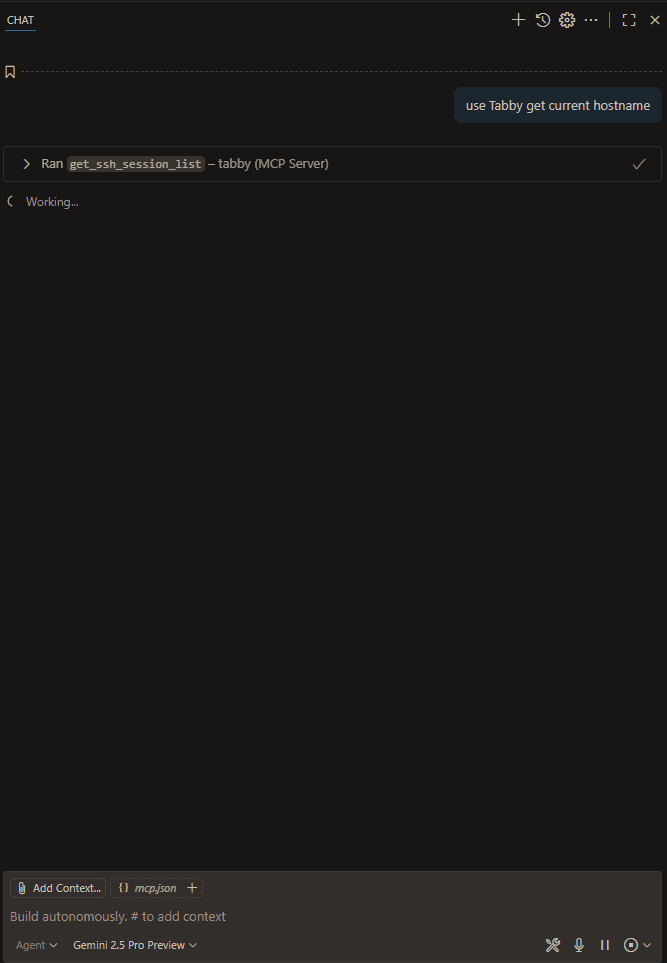
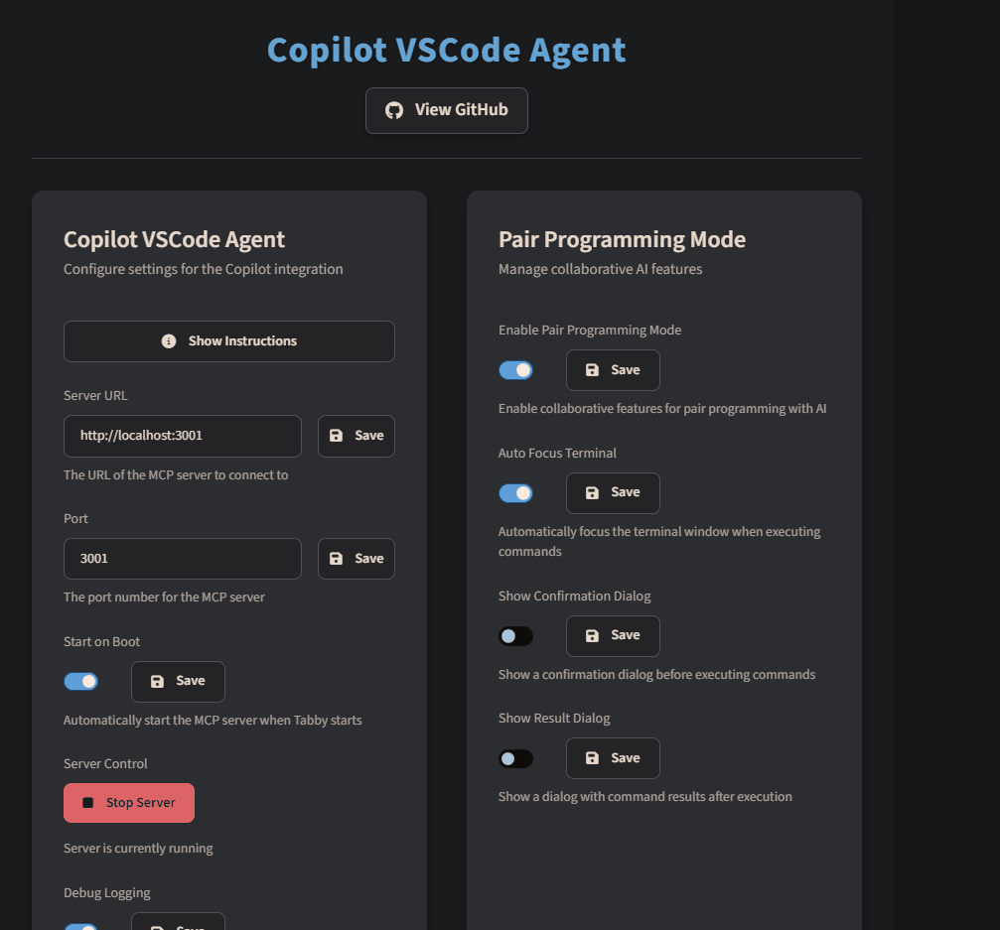

# 🚀 Tabby VSCode Agent

> The Tabby VSCode Agent is an advanced plugin for [Tabby Terminal](https://github.com/Eugeny/tabby), designed to seamlessly integrate AI-powered terminal control and automation directly within VS Code. Building upon the foundations of the original [Tabby MCP Server](https://github.com/thuanpham582002/tabby-mcp-server), this improved version offers enhanced functionality, quicker speeds, and a more refined user experience tailored for VS Code users.

## 🆕 What's New in 1.0.8 (21-07-2025)

### Added
- VSCode Extension Support, listens to http port. 
- Fixed URL Opening links
- Increased speed of reading SSH sessions
- Fixed issue with opening VSCode via non extension
- Fixed UI for Command History
- Enhanced support for VS Code integration
- Added support for VSCode Extension
- Copilot agent chat can now be opened directly from the navbar
- New and improved UI elements for a more modern look
- Updated and fixed navbar for better navigation and stability
- Improved command execution speeds and responsiveness
- Quick access to settings and chat from the main interface
- More robust error handling and feedback for users
- Optimized MCP server communication for lower latency
- Improved hotkey support and customization
- Better handling of long-running commands and output

### Fixed
- Navbar rendering issues in some VS Code versions
- UI glitches in command dialogs and modals
- Minor bugs in command history and output storage
- Various performance and stability improvements

## 📹 Video Demonstrations

Witness the Tabby VSCode Agent in action with these comprehensive video demonstrations:

### VSCode Agent in Action
[](assets/gifs/vscodeagent.gif)

### Tabby Settings Overview
[](assets/gifs/tabbysettings.gif)

## ✨ Key Features

- 🤖 **AI Integration**: Effortlessly connect AI assistants to your terminal for intelligent command execution and automation.
- 🔌 **Built-in MCP Server**: Features a robust Model Context Protocol (MCP) server implementation for reliable communication.
- 🚀 **Deep VS Code Integration**:
    - **Open Chat from Navbar**: Instantly open the Copilot chat window directly from the Tabby navigation bar within VS Code.
    - **Optimised Settings & Logins**: Enjoy a redesigned settings interface and streamlined login processes for a smoother workflow.
    - **Enhanced Speed**: Experience significantly quicker response times and overall performance.
- 📦 **Bundled Stdio Server**: Includes `tabby-mcp-stdio` for a stable and efficient connection with VS Code.
- 🖥️ **Terminal Control**: Empower AI to execute commands, read terminal output, and manage your sessions.
- 🔍 **Session Management**: View and manage your SSH sessions directly from the plugin.
- 🚫 **Command Abort**: Safely abort any running commands with ease.
- 📋 **Buffer Access**: Retrieve terminal buffer content with flexible line range options.
- 🔒 **Pair Programming Mode**: An optional safety feature that requires confirmation before AI executes commands, ensuring you maintain control.
- 📊 **Command History**: Keep track of and review all previously executed commands.
- 🔄 **Command Output Storage**: Access complete command outputs with convenient pagination.

## 🔧 Installation

### Install from Tabby Plugin Store

1.  Open Tabby settings and navigate to **Plugins → MCP**.
2.  Locate and click "Install" on the **Tabby VSCode Agent** plugin.
3.  Restart Tabby to finalise the installation.
4.  Proceed to configure VS Code with the MCP Server as detailed below.

## 🚀 Quick Start

1.  Ensure the plugin is installed using one of the methods above.
2.  Launch Tabby and go to **Settings → Copilot**.
3.  Within the settings page, you'll find a collapsible **"Instructions"** section. This provides detailed, step-by-step guidance on how to integrate the agent with VS Code.
4.  Configure the MCP server port (default: `3001`).
5.  Toggle "Start on Boot" if you wish for the server to automatically launch with Tabby.
6.  Connect your preferred AI client to the MCP server. A list of supported clients can be found at [https://modelcontextprotocol.io/clients](https://modelcontextprotocol.io/clients).

## 💻 Usage Examples

### Connecting an AI to Control Your Terminal

1.  Start Tabby with the Tabby VSCode Agent plugin enabled.
2.  Configure your AI client to connect to the MCP server (refer to [Connecting to MCP](#-connecting-to-mcp) for details).
3.  Instruct your AI assistant to run commands or manage your terminal sessions.

Example AI prompt:
```
Connect to my Tabby VSCode Agent and list all available terminal sessions.
Then execute the command "ls -la" in the first available terminal.
```

## 🔗 Connecting to MCP

### HTTP Server (Recommended for most clients)

To configure AI clients to use your MCP server, add the following to your `mcp.json` file:

```json
{
	"servers": {
		"tabby": {
			"url": "http://localhost:3001/sse",
			"type": "http"
		}
	}
}
```

### Stdio Server (for VS Code)

For a more robust integration with VS Code, you can utilise the bundled `stdio` server.

1.  Navigate to **Settings → Copilot** in Tabby.
2.  Under the **Stdio Server** section, you will find the full path to the server script.
3.  Click the "Copy" button to copy the path to your clipboard.
4.  In your VS Code `mcp.json`, configure the server as shown below, pasting the copied path:

```json
{
    "servers": {
        "tabby-stdio": {
            "type": "stdio",
            "command": "node",
            "args": ["<PASTE THE COPIED PATH HERE>"]
        }
    }
}
```

### Pair Programming Mode

The plugin includes a "Pair Programming Mode" to enhance safety when AI assistants control your terminal:

-   **Confirmation Dialogue**: Prompts the user for confirmation before executing commands.
-   **Auto Focus Terminal**: Automatically focuses the terminal when commands are executed.
-   **Command Rejection**: Provides the ability to reject commands with feedback.

To enable Pair Programming Mode:

1.  Go to Tabby settings → Copilot.
2.  Toggle "Enable Pair Programming Mode".
3.  Configure additional safety options as required.

## 📚 API Reference

### Available Tools

| Tool | Description | Parameters |
|------|-------------|------------|
| `open-vscode-chat` | Opens the VSCode chat window. | None |
| `get_ssh_session_list` | Get list of all terminal sessions | None |
| `exec_command` | Execute a command in terminal | `command`, `tabId`, `commandExplanation` |
| `get_terminal_buffer` | Get terminal content | `tabId`, `startLine`, `endLine` |
| `get_command_output` | Retrieve complete command output | `outputId`, `startLine`, `maxLines` |

## 🤝 Contributing

Contributions are highly encouraged! Here's how you can contribute to the Tabby VSCode Agent:

1.  Fork the repository.
2.  Create a new feature branch (`git checkout -b feature/your-feature`).
3.  Commit your changes (`git commit -m 'Add your feature'`).
4.  Push your branch to the origin (`git push origin feature/your-feature`).
5.  Open a Pull Request.

Please refer to the [contributing guidelines](CONTRIBUTING.md) for more detailed information.

### Development Workflow

1.  Clone the repository and install dependencies:
    ```bash
    git clone https://github.com/SteffMet/tabby-vscode-agent.git
    cd tabby-vscode-agent
    npm install
    ```

2.  Make your desired changes to the codebase.

3.  Build the plugin:
    ```bash
    npm run build
    ```

4.  Test the plugin with Tabby:
    ```bash
    npm run deploy
    ```

## 📝 Licence

This project is licensed under the MIT Licence - see the [LICENCE](LICENCE) file for details.

---

<p align="center">
  Made with ❤️ by <a href="https://github.com/SteffMet">SteffMet</a>
</p>